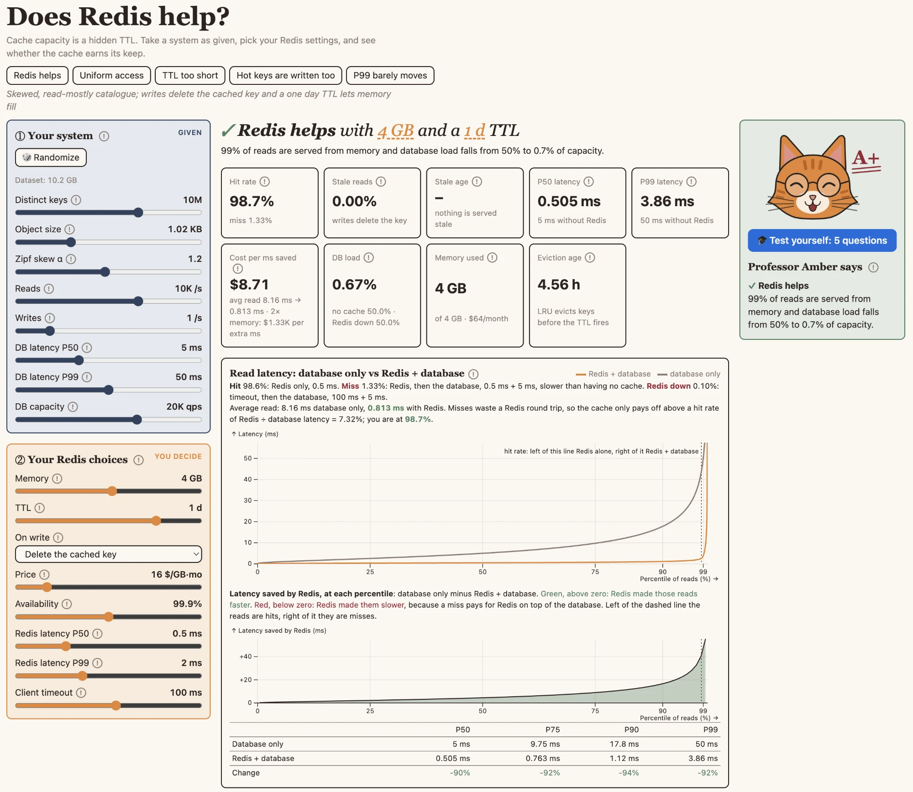
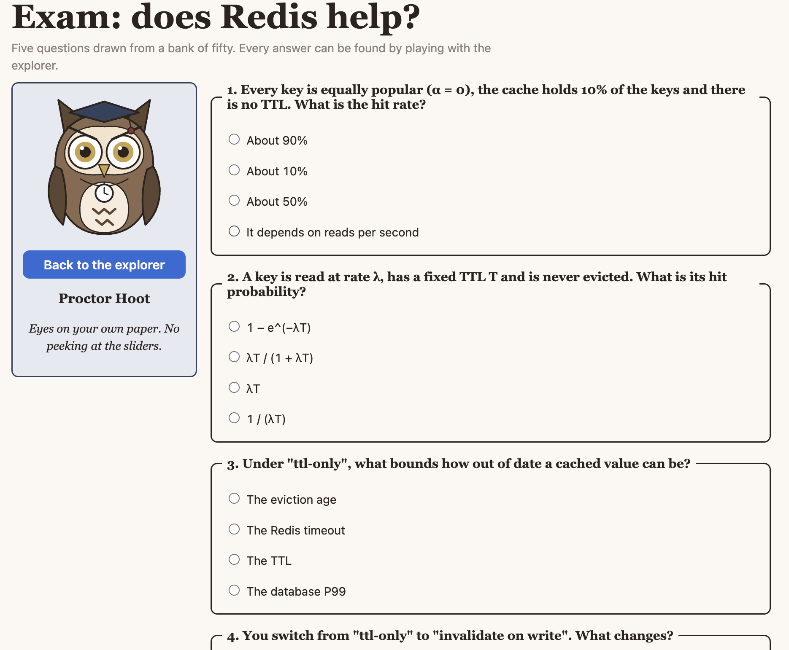

# Does Redis help?

An explorable model of a Redis cache in front of a database. Describe a system, make your Redis choices (memory, TTL, write policy), and see what they actually buy: miss rate, stale reads, latency percentiles, database load and cost — with an in-browser simulator that checks the math.

**Live:** https://limboantique.github.io/Anthropic/ · **Theme 1: Exploration & Understanding** (the form is an explorable explanation; the subject is systems reliability)



*The explorer, showing the "Redis helps" preset: database only versus Redis + database by percentile, and the latency Redis saves at each one.*



*The exam: five questions drawn from a bank of fifty, invigilated by Proctor Hoot.*

## Why this, and what is non-obvious

Adding Redis is one of the most common reflexes in system design: whenever a system needs higher read throughput or lower latency, a cache is the first thing proposed. A cache is not a single decision, however. It comes with parameters (how much memory, what TTL, how writes are handled), and those parameters determine whether it helps at all. A poorly configured Redis can leave the system no better off, or make it worse: every miss pays for both Redis and the database, a long TTL serves stale data, and a cache that absorbs load turns into a dependency the database can no longer survive without.

This tool replaces that reflex with a model. Given a description of the system, it shows what a particular set of Redis choices actually buys, and why. Several related concerns are deliberately out of scope: key design, stampedes and multi-tier caching, and replica lag. They matter in practice, but they are either specific to one system or operational in nature, and none of them changes how the parameters should be chosen.

I submitted this under Theme 1 because the problem is one of understanding. A static explanation of caching cannot show that a one-hour TTL has no effect because eviction removes the key first; a model that responds as the inputs are dragged can. The subject matter belongs to Theme 3 (tail latency, staleness, behaviour when the cache is unavailable), and I chose to teach that engineering judgment rather than to build one more system that embodies it.

Things the tool makes visible that most "just add Redis" conversations miss:

- **A miss is slower than having no cache.** A read that misses pays for Redis and then for the database. The honest comparison is therefore *database only* versus *Redis + database*, and on average the cache only pays off while the hit rate exceeds Redis latency ÷ database latency. Below that it is a net slowdown: in the "Uniform access" preset the *latency saved* chart is red from the first percentile to the last.
- **Value for money is one number.** *Cost per ms saved* is the monthly bill divided by the milliseconds taken off the average read, shown next to the same ratio for the next doubling of memory. When the second is a hundred times the first, you are past the knee.
- **Cache size is a TTL in disguise.** An LRU cache of a given size behaves like a TTL cache whose timer is the *eviction age* `Tc` (Che's approximation). Memory and TTL are therefore in the same unit — seconds — and only the smaller one matters for a cold key. A TTL above `Tc` changes little; a TTL far below `Tc` leaves memory you pay for empty.
- **Without a TTL, hit rate does not depend on traffic volume** — only on skew and on the cached fraction. Traffic matters only through the TTL and through writes.
- **P99 is still a database read** until misses fall below 1%. With miss rate `m`, the cached P99 equals the database's `1 − 0.01/m` quantile plus the Redis round trip: in the default scenario the median gets 8× faster (5 → 0.6 ms) while P99 only goes from 50 to 27 ms.
- **Staleness follows the hot keys, not the write ratio.** Stale reads scale with *per-key* write rate × TTL. If hot keys are also written most, 1 write per 100 reads with a one hour TTL leaves most reads stale.
- **How stale, not only how often.** *Stale reads* is the share of reads that disagree with the database; *Stale age* is how long ago the database value changed when that happens. The worst case is the TTL, and with no TTL a hot key is never corrected at all. The simulator measures the same quantity; the model is within 2.5% of it.
- **A cache that carries load is an availability dependency.** If the database cannot absorb full traffic, a Redis outage is a full outage.

## What is on the page

- **Your system** (given) and **Your Redis choices** (decide): two separate input cards. 🎲 randomises only the system, which turns the page into an exercise: here is a system, now configure Redis. Five presets each demonstrate one way a cache goes right or wrong.
- **Verdict** and **tiles**: hit rate, stale reads and stale age, P50/P99 against the database alone, cost per ms saved, database load (with cache, without, and with Redis down), memory actually used, eviction age.
- **Read latency: database only vs Redis + database** (the central figure): the three paths a read can take with their shares, the break-even hit rate, latency by percentile for both setups, the *latency saved by Redis* at each percentile (green where it helped, red where a miss made things slower), and a table with the change per percentile.
- **Miss rate vs memory** (with monthly cost and the ideal-cache bound), **miss and stale reads vs TTL** (with the eviction age marked), **which keys are cached** (hit probability by popularity rank).
- **Can you trust these numbers?** The referee panel: an in-browser simulation checks the formulas.
- **Professor Amber** grades the configuration with twelve rules, each quoting the numbers that triggered it. **Six lessons** explain the ideas, four of them with a button that loads the matching preset.
- **Exam** (`exam.html`): five questions drawn from a bank of fifty, marked with explanations, invigilated by Proctor Hoot. Numeric claims in the bank are unit-tested against the model.

## The model

Keys have Zipf popularity `p_i ∝ i^-α`; reads and writes are Poisson with per-key rates `λ_i = rps·p_i`, `w_i = wps·p_i`. Capacity is `C = memory / (object size + 100 B)`.

A key is inserted on a miss and then leaves the cache at the earliest of: its TTL `T` (counted from insertion — Redis does not refresh it on reads), LRU eviction, or, under the *invalidate* policy, the next write. LRU eviction happens the first time the key goes unread for `Tc`; that moment is approximated as `L ≈ Tc + Exp(m)` with the exact mean `E[L] = (e^{λTc} − 1)/λ`.

```
life(λ, w, T, Tc) = ∫₀ᵀ P(L > t) · e^{-wt} dt                      closed form, see src/engine/model.ts
ℓ      = life(λ, invalidate ? w : 0, T, Tc)
hit_i  = occupancy_i = λℓ / (1 + λℓ)                                renewal-reward + PASTA
Tc     : Σ occupancy_i(Tc) = C        (Tc = ∞ if the TTL alone keeps memory from filling)
stale_i = hit_i · (1 − life(λ, w, …) / life(λ, 0, …))               ttl-only policy
age_i   = (∫₀ᵀ t·P(L > t) dt − (ℓ₀ − ℓ_w)/w) / (ℓ₀ − ℓ_w)             mean time a stale read's value has been out of date
```

Limits it reproduces exactly: no TTL → Che's `1 − e^{-λTc}`; no eviction → the classic fixed-timer `λT/(1+λT)`; uniform popularity → `C/N`.

Popularity is evaluated on 256 exact ranks plus geometric bins, so 10⁹ keys cost under 1 ms. Latency is a mixture of lognormals fitted to each P50/P99: a hit (Redis), a miss (Redis, then database), or an outage (client timeout, then database); percentiles are read off the mixture CDF.

### How much to trust it

`src/engine/sim.ts` is an independent discrete-event simulation of a real LRU list with insertion-time TTLs, Poisson traffic and both write policies. It shares no formula with the model. `test/cross.test.ts` compares the two:

| | max \|model − simulation\| |
|---|---|
| 64-point grid: skew × cached fraction × write policy × TTL (none, 1.5·`Tc`, `Tc`, `Tc`/10), miss rate and stale rate | **0.35 pp** |
| The page's own path: defaults, all presets, slow-to-warm edge cases and 16 seeded random systems, scaled the way the browser scales them | 1.09 pp |
| Stale age on the grid (a duration, so compared relatively) | within 2.5% |

On the page, the **"Can you trust these numbers?"** panel runs the same simulator in a Web Worker for the current settings and eight variations (four memory sizes, four TTLs) and plots prediction against measurement; points on the diagonal agree. Changing any setting discards the points, since they describe the settings they ran with.

### Assumptions and non-goals

- Independent reference model: stationary popularity, no bursts or churn. Real traces have temporal locality, which helps LRU.
- Writes share the read popularity distribution. Stale-read figures depend heavily on this.
- `allkeys-lru` with exact LRU (Redis samples 5 keys; close in practice) and instant expiry (Redis expires lazily plus a background sweep). Redis' *default* policy is `noeviction`, which this tool does not model.
- Uniform object size; 100 B per-key overhead.
- Deliberately out of scope: key design, stampedes / penetration / multi-tier caches, replica lag, cold-start after an outage.

## Design decisions and tradeoffs

- **Analytic model first, simulator as the referee.** Sliders need answers in milliseconds, which only a closed form gives; a closed form needs a reason to be believed, which only a simulation gives. Both ship.
- **Inputs split into "your system" (given) and "your Redis choices" (decide).** The dice button randomises only the system, turning the page into an exercise.
- **Static site, no backend, no LLM.** Opens instantly, nothing to install, no key to protect.
- **TypeScript, no UI framework.** One state object and a pure `evaluate(params)`; a framework would add more code than it removes.
- **Contract-first, built by parallel agents.** Types and module signatures were frozen before any logic existed, so the model, the simulator and the UI were written concurrently against stubs, each owning disjoint files (`PLAN.md`).

## With more time

- Calibrate from production: enter an observed hit rate, solve for α, then predict the effect of a resize.
- Separate write popularity from read popularity.
- Extend the per-key view (hit probability by popularity rank is already on the page) to show which mechanism removes each key: TTL, eviction or a write.
- LFU and Redis' sampled LRU as alternative policies; `noeviction` failure mode.
- Database queueing under load, to show the metastable collapse when the cache disappears.
- Adding System Analysis tool, to auto fill 'Your System' Section

## Time spent

2.5 hours

## Code map

```
src/contract/   types.ts inputs.ts                      frozen protocol: parameters, outputs, slider specs
src/engine/     model.ts sim.ts worker.ts advisor.ts presets.ts quiz.ts   math, simulator, advisor rules, presets, question bank (no DOM)
src/ui/         main.ts exam.ts style.css exam.css      the explorer and the exam page
cat_teacher/    generate.py + SVGs                      Professor Amber's faces and Proctor Hoot, generated by one Python script
test/           88 tests: model limits, simulator self-checks, model-vs-simulation grid and Validate path, presets, advisor rules, question bank
PLAN.md         the plan the agents worked from, with the shared TODO table; VIDEO.md is the video outline
```

`npm install && npm test && npm run dev` (Node ≥ 20). Pushing to `main` tests, builds and deploys to GitHub Pages.

## References

- Fricker, Robert, Roberts. *A versatile and accurate approximation for LRU cache performance.* 2012. https://arxiv.org/abs/1202.3974
- Basu et al. *Adaptive TTL-Based Caching for Content Delivery.* 2017. https://arxiv.org/abs/1704.04448
- Mao, Iyer, Shenker, Stoica. *Revisiting Cache Freshness for Emerging Real-Time Applications.* HotNets 2024. https://arxiv.org/abs/2412.20221
- Yang, Yue, Rashmi. *A large scale analysis of hundreds of in-memory cache clusters at Twitter.* OSDI 2020. https://www.usenix.org/conference/osdi20/presentation/yang
- Redis key eviction. https://redis.io/docs/latest/develop/reference/eviction/
- Marc Brooker. *Caches, Modes, and Unstable Systems.* https://brooker.co.za/blog/2021/08/27/caches.html
